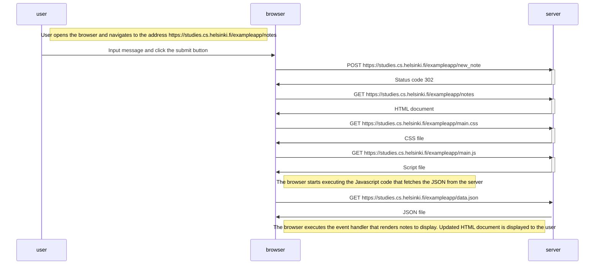

```mermaid
sequenceDiagram 
participant user
participant browser 
participant server

Note right of user: User opens the browser and navigates to the address https://studies.cs.helsinki.fi/exampleapp/notes

user->>browser: Input message and click the submit button

browser->>server: POST https://studies.cs.helsinki.fi/exampleapp/new_note
activate server
server->>browser: Status code 302
deactivate server

browser->>server: GET https://studies.cs.helsinki.fi/exampleapp/notes
activate server
server->>browser: HTML document
deactivate server

browser->>server: GET https://studies.cs.helsinki.fi/exampleapp/main.css
activate server
server->>browser: CSS file
deactivate server

browser->>server: GET https://studies.cs.helsinki.fi/exampleapp/main.js
activate server
server->>browser: Script file
deactivate server

Note right of browser: The browser starts executing the Javascript code that fetches the JSON from the server

browser->>server: GET https://studies.cs.helsinki.fi/exampleapp/data.json
activate server
server->>browser: JSON file

Note right of browser: The browser executes the event handler that renders notes to display. Updated HTML document is displayed to the user
```