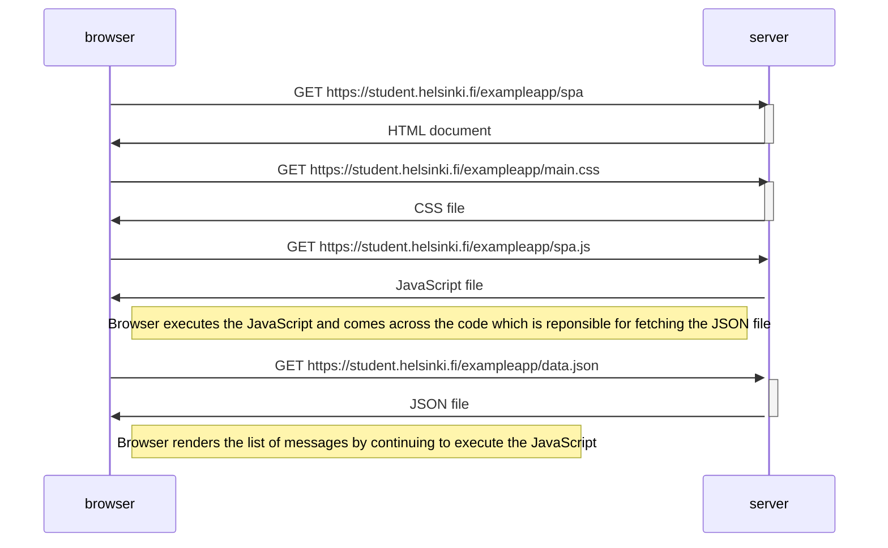

```mermaid

sequenceDiagram
	participant browser
	participant server

	browser->>server: GET https://student.helsinki.fi/exampleapp/spa
	activate server
	server->>browser: HTML document
	deactivate server

	browser->>server: GET https://student.helsinki.fi/exampleapp/main.css
	activate server
	server->>browser: CSS file
	deactivate server

	browser->>server: GET https://student.helsinki.fi/exampleapp/spa.js
	activate server
	server->>browser: JavaScript file

	Note right of browser: Browser executes the JavaScript and comes across the code which is reponsible for fetching the JSON file

	browser->>server: GET https://student.helsinki.fi/exampleapp/data.json
	activate server
	server->>browser: JSON file
	deactivate server

	Note right of browser: Browser renders the list of messages by continuing to execute the JavaScript
	
```