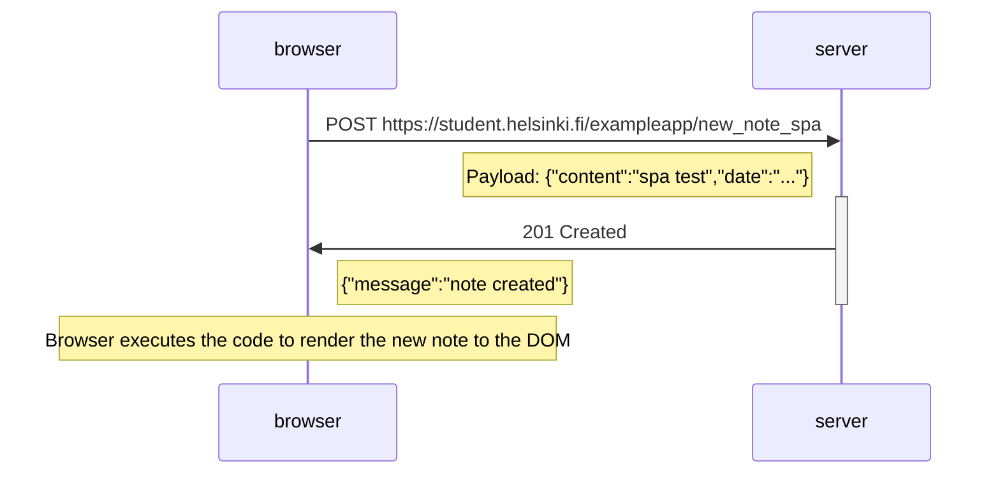

```mermaid

sequenceDiagram
	participant browser
	participant server

	browser->>server: POST https://student.helsinki.fi/exampleapp/new_note_spa
	Note left of server: Payload: {"content":"spa test","date":"..."}
	activate server
	server->>browser: 201 Created
	Note right of browser: {"message":"note created"}
	deactivate server

	Note over browser: Browser executes the code to render the new note to the DOM

```